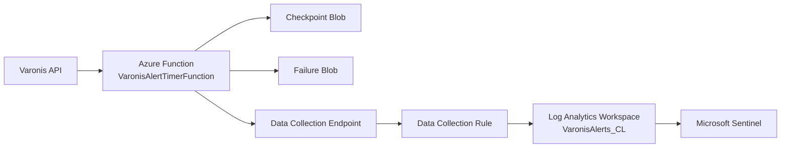

# Architecture

## Overview
`AzureFunctionVaronis` ingests Varonis alert data into Microsoft Sentinel using Azure Monitor Logs Ingestion API.

## Deployment Flow
1. Deploy core Azure resources with `infra/modules/core.bicep`.
2. Reconcile table lifecycle with `scripts/Invoke-TableLifecycle.ps1`.
3. Deploy DCE/DCR/role assignment with `infra/modules/monitoring.bicep`.
4. Build and version ZIP package with `scripts/Build-Package.ps1`.
5. Publish ZIP and update `WEBSITE_RUN_FROM_PACKAGE` with `scripts/Publish-Package.ps1`.
6. Validate function health, DCR wiring, and ingestion with `scripts/Validate-Deployment.ps1`.

## Runtime Flow
1. Timer trigger runs `VaronisAlertTimerFunction` on configured CRON.
2. Function reads checkpoint from blob (`varonis-checkpoints` container).
3. Function authenticates to Varonis API using API key from Key Vault.
4. Function queries Varonis alert search API from checkpoint to current UTC.
5. Function maps payload to DCR stream schema and uploads via `LogsIngestionClient`.
6. On success: checkpoint advances.
7. On failure: failed batch payload is stored in `varonis-failures` container.

## Dependency Graph
- Azure Function App depends on:
  - App Service plan
  - Function runtime storage account
  - Key Vault secret access
  - DCR immutable ID + endpoint app settings
- DCR depends on:
  - Log Analytics workspace
  - Custom table schema
  - DCE endpoint
- CI/CD depends on:
  - OIDC service principal permissions
  - Package storage account access

## Security Model
- Function App uses system-assigned managed identity.
- Varonis API key is stored in Key Vault, never hardcoded in source.
- Function identity has Key Vault Secrets User RBAC on the vault.
- Function identity is assigned DCR sender role (`Monitoring Metrics Publisher`) on the DCR.
- Package blobs are private; deployment uses SAS URL for run-from-package.
- All storage uses TLS 1.2 minimum and public blob access disabled.
